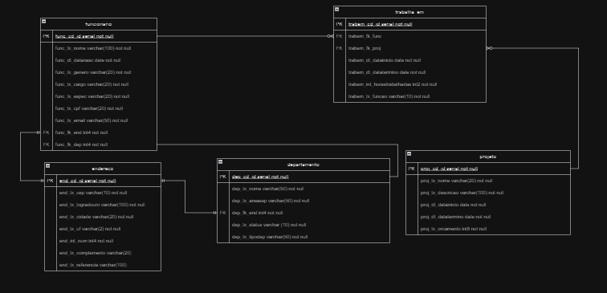

# POO-individual
<h1 align="center">
    
</h1>

## :detective:Índice

<ul>
    <li>Sobre o Projeto</li>
    <li>Tecnologias utilizadas</li>
    <li>Autores do Projeto</li>
</ul>

## :desktop_computer:Sobre o Projeto

Um menu que tem opção de imprimir até 3 tipos de relatórios no console ou em arquivo .txt

## :hammer_and_wrench: Tecnologias utilizadas

- [SpringToolSuite4](https://spring.io/tools)
- [GitHub](https://github.com/)

## :chart_with_upwards_trend: Diagramas

  
  ## Modelo Lógico
   

## Autor
- :boy:
Victor Hugo Martins França - https://github.com/VictorHmfr